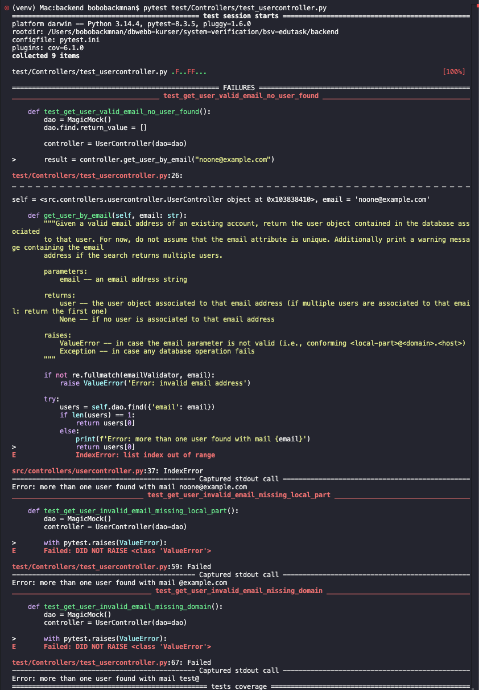

## Work distribution

This assignment was completed during a video chat session between the group members where they discussed and worked together on completing it.

1.1 Mocking is the practice of replacing a function or database with a fake implementation that returns a predetermined result.

1.2 Mocking fulfills two purposes in unit testing: isolation and control. By replacing dependencies like databases or external services with fakes, you isolate the unit under test so that failures can only originate from the code you're actually testing. Mocking also gives you full control over what those dependencies return, making tests deterministic and reliable.

2.1 The oracle used is the method's docstring, which defines 
the expected behavior for valid/invalid emails and database outcomes.

For testing `get_user_by_email` we will use followsing test methods:
Equivalence partitioning + limit value analysis on the email validation
| Partition | Example | Expected |
|-----------|---------|----------|
| Valid email | test@ex.ex | Returns user |
| Missing @ | testex.ex | ValueError |
| Missing local-part | @ex.ex | ValueError |
| Missing domain | test@ | ValueError |
| Empty string | "" | ValueError |

High-Level Scenario Test - Expected Outcome

| # | Scenario | Input | Expected Outcome |
|---|---|---|---|
| 1 | Valid email, user exists | `"test@example.com"` | Returns the user object |
| 2 | Valid email, no user found | `"noone@example.com"` | Returns `None` |
| 3 | Valid email, multiple users found | `"dup@example.com"` | Returns first user |
| 4 | Invalid email – missing `@` | `"testexample.com"` | Raises `ValueError` |
| 5 | Invalid email – missing local-part | `"@example.com"` | Raises `ValueError` |
| 6 | Invalid email – missing domain | `"test@"` | Raises `ValueError` |
| 7 | Empty string | `""` | Raises `ValueError` |
| 8 | `None` as input | `None` | Raises `Exception` or `TypeError` |
| 9 | Database failure | Valid email, DB is down | Raises `Exception` |

2.2 [https://github.com/21mmslak/bsv-edutask/backend/test/Controllers/test_usercontroller.py](https://github.com/21mmslak/bsv-edutask/blob/master/backend/test/Controllers/test_usercontroller.py)

2.3

2.4 
src/controllers/usercontroller.py      24      5    79%   42-46
The test suite achieved 79% statement coverage for usercontroller.py. Thas means that most of the code in the file was executed by the tests. The uncovered lines are lines 42–46, which belong to the update method. Since the assignment focuses on testing get_user_by_email, these uncovered lines are outside the scope of this test suite. Therefore, the coverage is considered sufficient for evaluating the tested method. 
