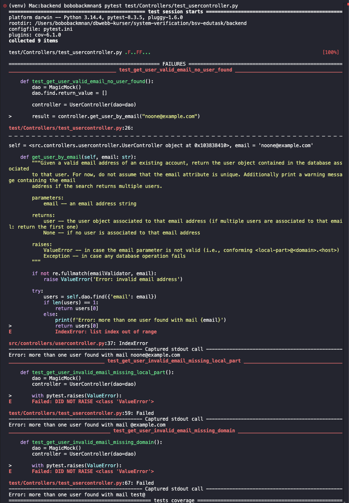

## Work distribution

This assignment was completed during a video chat session between the group members where they discussed and worked together on completing it.

1.1 Mocking is the practice of replacing a function or database with a fake implementation that returns a predetermined result.

1.2 Mocking fulfills two purposes in unit testing: isolation and control. By replacing dependencies like databases or external services with fakes, you isolate the unit under test so that failures can only originate from the code you're actually testing. Mocking also gives you full control over what those dependencies return, making tests deterministic and reliable.

2.1
**Step 1 – Oracle**
The oracle is the method's docstring, which specifies:
- Returns a user object if exactly one match is found
- Returns None if no user is found
- Raises ValueError for invalid email format
- Raises Exception on database failure

**Step 2 – Conditions**
- Email format validity       [valid / invalid]
- Number of users found in DB [0 / 1 / multiple]
- Database availability       [up / down]

**Step 3 – Test cases (EP + BVA on conditions)**

| # | Email format | DB result        | DB available |
|---|-------------|------------------|--------------|
| 1 | valid       | 1 user found     | yes          |
| 2 | valid       | 0 users found    | yes          |
| 3 | valid       | multiple found   | yes          |
| 4 | valid       | –                | no           |
| 5 | invalid (missing @)    | –       | yes          |
| 6 | invalid (missing local)| –       | yes          |
| 7 | invalid (missing domain)| –      | yes          |
| 8 | empty string           | –       | yes          |
| 9 | None                   | –       | yes          |

**Step 4 – Expected outcomes**

| # | Expected outcome         |
|---|--------------------------|
| 1 | Returns user object      |
| 2 | Returns None             |
| 3 | Returns first user       |
| 4 | Raises Exception         |
| 5 | Raises ValueError        |
| 6 | Raises ValueError        |
| 7 | Raises ValueError        |
| 8 | Raises ValueError        |
| 9 | Raises TypeError/Exception|

2.2 [https://github.com/21mmslak/bsv-edutask/backend/test/Controllers/test_usercontroller.py](https://github.com/21mmslak/bsv-edutask/blob/master/backend/test/Controllers/test_usercontroller.py)

2.3

2.4 
src/controllers/usercontroller.py      24      5    79%   42-46
The test suite achieved 79% statement coverage for usercontroller.py. Thas means that most of the code in the file was executed by the tests. The uncovered lines are lines 42–46, which belong to the update method. Since the assignment focuses on testing get_user_by_email, these uncovered lines are outside the scope of this test suite. Therefore, the coverage is considered sufficient for evaluating the tested method. 
