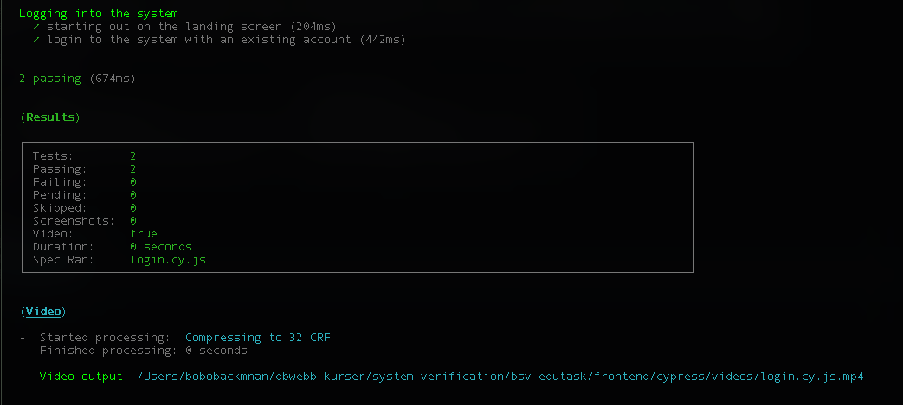
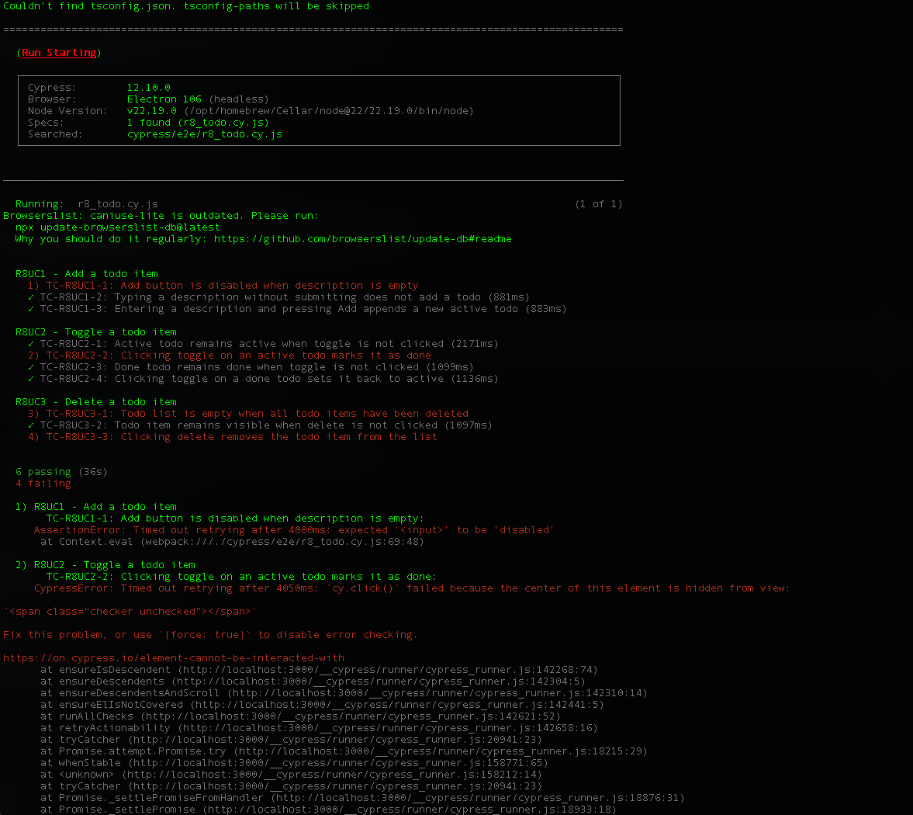
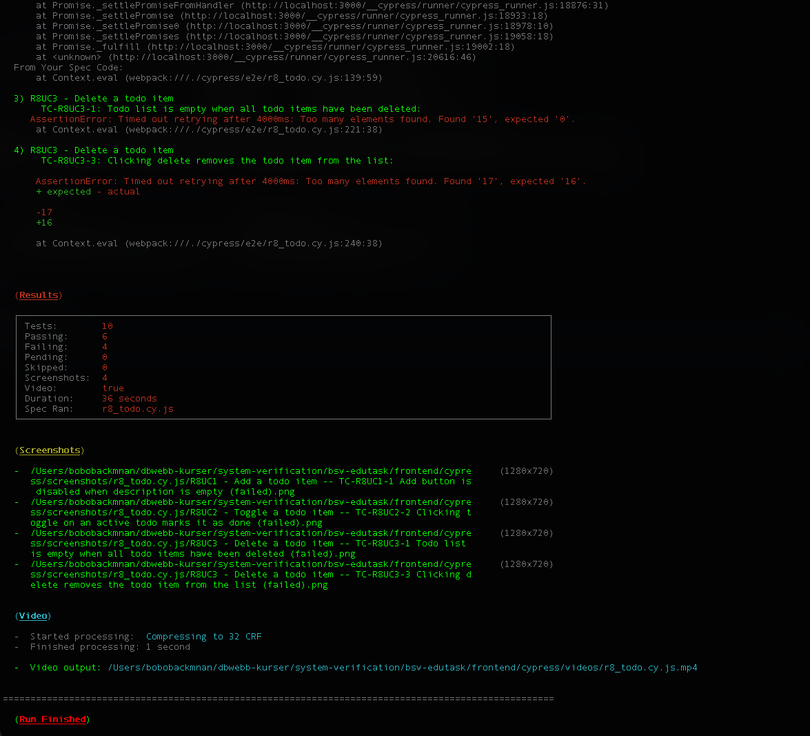
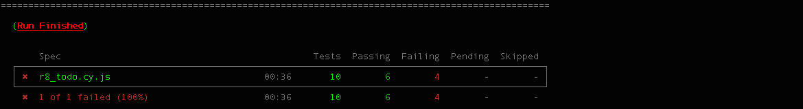

# Assignment 4: GUI Testing

## Work distribution

This assignment was completed during a video chat session between the group members where they discussed and worked together on completing it.

## Deliverable 1

### R8UC1

#### Scenario

> An authenticated user wants to add a todo to a task they're viewing in detail view mode. User enters a description into the empty input field and presses the "Add" button. If the description is not empty a new todo with the given description is added to the bottom of the list of existing todo items. If the description is empty the "Add" button is disabled.

#### Step 1: Identify Actions and Conditions

The scenario contains one action:

> Adding a todo item := [successful; unsuccessful]

The conditions that can affect the outcome of the action are:

1. Todo description := [empty; non-empty]
2. User presses "Add" := [yes; no]

#### Step 2: Construct Combinations

The two conditions each have two values, producing $2^2 = 4$ valid combinations.

| ID  | Todo description | User presses “Add” |
| --- | ---------------- | ------------------ |
| 1   | Empty            | No                 |
| 2   | Empty            | Yes                |
| 3   | Non-empty        | No                 |
| 4   | Non-empty        | Yes                |

#### Step 3: Denote Expected Outcome

Reading the scenario, the expected outcome of _adding a todo item_ is successful only if the description is non-empty and the user presses "Add". Otherwise, the action is unsuccessful. If the description is empty, the "Add" button is disabled.

| ID  | Todo description | User presses “Add” | Adding a todo item | Expected System Behavior                   |
| --- | ---------------- | ------------------ | ------------------ | ------------------------------------------ |
| 1   | Empty            | No                 | Unsuccessful       | “Add” button disabled, no todo created     |
| 2   | Empty            | Yes                | Unsuccessful       | “Add” button disabled, no todo created     |
| 3   | Non-empty        | No                 | Unsuccessful       | No todo created                            |
| 4   | Non-empty        | Yes                | Successful         | New active todo appended to bottom of list |

#### Step 4: Collapse to the Relevant Test Cases

| ID  | Todo description | User presses “Add” | Adding a todo item | Expected System Behavior                   |
| --- | ---------------- | ------------------ | ------------------ | ------------------------------------------ |
| 1   | Empty            | -                  | Unsuccessful       | “Add” button disabled, no todo created     |
| 2   | Non-empty        | No                 | Unsuccessful       | No todo created                            |
| 3   | Non-empty        | Yes                | Successful         | New active todo appended to bottom of list |

How the collapse was derived:

1. Row 1 captures the rule that an empty description always is unsuccessful with the "Add" button disabled. This replaces the two rows in Step 3 where "Todo description" = empty.
2. Row 2 captures the unsuccessful scenarion of a non-empty description but the user does not press "Add".
3. Row 3 captures the happy path of a non-empty description and the user presses "Add".

#### Test cases for R8UC1

| TC ID      | Scenario                                           | Expected Result                              |
| ---------- | -------------------------------------------------- | -------------------------------------------- |
| TC-R8UC1-1 | Enter empty description                            | “Add” button remains disabled, no todo added |
| TC-R8UC1-2 | Enter non-empty description without pressing “Add” | No todo added                                |
| TC-R8UC1-3 | Enter non-empty description and press “Add”        | New active todo appended to bottom of list   |

### R8UC2

#### Scenario

> An authenticated user wants to toggle the status of an existing todo item while viewing a task in detail view mode. The user clicks the icon in front of the description. If the todo item was active it is set to done and is struck through. If the item was done it is set to active and is no longer struck through.

#### Step 1: Identify Actions and Conditions

The scenario contains one action:

Toggling a todo item := [successful]

The conditions affecting the outcome are:

1. Todo item status := [active; done]
2. User clicks toggle icon := [yes; no]

#### Step 2: Construct Combinations

The two conditions each have two values, producing $2^2 = 4$ valid combinations.

| ID  | Todo item status | User clicks toggle icon |
| --- | ---------------- | ----------------------- |
| 1   | Active           | No                      |
| 2   | Active           | Yes                     |
| 3   | Done             | No                      |
| 4   | Done             | Yes                     |

#### Step 3: Denote Expected Outcome

Reading the scenario, the expected outcome of _toggling a todo item_ is the item being toggled from active -> done or done -> if the user clicks the icon. The status is unchanged if the user does not click the icon.

| ID  | Todo item status | User clicks icon | New todo item status | Expected System Behavior                 |
| --- | ---------------- | ---------------- | -------------------- | ---------------------------------------- |
| 1   | Active           | No               | Active               | Item is unchanged and not struck through |
| 2   | Active           | Yes              | Done                 | Item becomes struck through              |
| 3   | Done             | No               | Done                 | Item remains struck through              |
| 4   | Done             | Yes              | Active               | Strike-through is removed                |

#### Step 4: Collapse to the Relevant Test Cases

No rows can be collapsed as the initial status determines the outcome.

| ID  | Todo item status | User clicks icon | New todo item status | Expected System Behavior        |
| --- | ---------------- | ---------------- | -------------------- | ------------------------------- |
| 1   | Active           | No               | Active               | Item remains not struck through |
| 2   | Active           | Yes              | Done                 | Item becomes struck through     |
| 3   | Done             | No               | Done                 | Item remains struck through     |
| 4   | Done             | Yes              | Active               | Strike-through is removed       |

1. Row 1 captures an initial Active status without the user clicking the icon, leaving the item Active and not struck through.
2. Row 2 captures an initial Active status where the user clicks the icon, toggling it to Done and struck through.
3. Row 3 captures an initial Done status without the user clicking the icon, having status remaining Done and struck through.
4. Row 4 captures an initial Done status where the user clicks the icon, toggling it to Active and not struck through.

#### Test cases for R8UC2

| TC ID      | Scenario                            | Expected Result                                   |
| ---------- | ----------------------------------- | ------------------------------------------------- |
| TC-R8UC2-1 | Active todo without clicking toggle | Todo remains active and not struck through        |
| TC-R8UC2-2 | Click toggle on active todo         | Todo becomes done and struck through              |
| TC-R8UC2-3 | Done todo without clicking toggle   | Todo remains done and struck through              |
| TC-R8UC2-4 | Click toggle on done todo           | Todo becomes active and strike-through is removed |

### R8UC3

#### Scenario

> An authenticated user wants to delete an existing todo item from a task they're viewing in detail view mode. If the user clicks the x symbol behind the description the todo item is deleted.

#### Step 1: Identify Actions and Conditions

The scenario contains one action:

> Deleting a todo item := [successful; unsuccessful]

The conditions that can affect the outcome of the action are:

1. Todo item exists := [yes; no]
2. User clicks "x" symbol := [yes; no]

#### Step 2: Construct Combinations

The two conditions each have two values, producing $2^2 = 4$ valid combinations.

| ID  | Todo item exists | User clicks "x" symbol |
| --- | ---------------- | ---------------------- |
| 1   | No               | No                     |
| 2   | No               | Yes                    |
| 3   | Yes              | No                     |
| 4   | Yes              | Yes                    |

#### Step 3: Denote Expected Outcome

Reading the scenario, the expected outcome of _deleting todo item_ is successful only if the todo item exists and the user clicks the "x" symbol. Otherwise, the action is unsuccessful.

| ID  | Todo item exists | User clicks "x" symbol | Deleting todo item | Expected System Behavior       |
| --- | ---------------- | ---------------------- | ------------------ | ------------------------------ |
| 1   | No               | No                     | Unsuccessful       | No change to todo list         |
| 2   | No               | Yes                    | Unsuccessful       | No change to todo list         |
| 3   | Yes              | No                     | Unsuccessful       | Item remains in todo list      |
| 4   | Yes              | Yes                    | Successful         | Item is removed from todo list |

#### Step 4: Collapse to the Relevant Test Cases

| ID  | Todo item exists | User clicks "x" symbol | Deleting todo item | Expected System Behavior       |
| --- | ---------------- | ---------------------- | ------------------ | ------------------------------ |
| 1   | No               | -                      | Unsuccessful       | No change to todo list         |
| 2   | Yes              | No                     | Unsuccessful       | Item remains in todo list      |
| 3   | Yes              | Yes                    | Successful         | Item is removed from todo list |

1. Row 1 captures the rule that no item is deleted and no change is made to the todo list if no todo item exists.
2. Row 2 captures that the action is unsuccessful and no item is removed from the todo list if the user does not click the "x" symbol.
3. Row 3 captures that the action is successful, the item is removed from the list if the item exist and the user clicks the "x" symbol.

#### Test cases for R8UC3

| TC ID      | Scenario                                   | Expected Result                        |
| ---------- | ------------------------------------------ | -------------------------------------- |
| TC-R8UC3-1 | No todo item exists                        | No change to todo list                 |
| TC-R8UC3-2 | Existing todo item without clicking delete | Todo item remains visible in todo list |
| TC-R8UC3-3 | Click delete on existing todo item         | Todo item removed from todo list       |

## Deliverable 2
https://github.com/21mmslak/bsv-edutask/tree/master/frontend/cypress/e2e/r8_todo.cy.js

## Deliverable 3

The Cypress E2E test execution for requirement R8 resulted in 10 executed test cases, where 6 passed and 4 failed. The failing tests revealed both implementation defects and UI interaction issues. TC-R8UC1-1 confirmed a defect where the “Add” button was not disabled when the todo description was empty, violating the specified requirement. Additional failures in R8UC2 and R8UC3 were caused by Cypress being unable to properly interact with toggle and delete elements, indicating potential problems with element visibility or interaction handling in the GUI.

## 2. Declarative vs. imperative UI Testing
1. Declarative and Imperative UI Test Case Implementation

Imperative UI testing means that the test explicitly describes every step and interaction that should be performed in the user interface. The test specifies how the system should be tested by detailing actions such as clicking buttons, entering text, navigating pages, and verifying results step by step. Frameworks such as Cypress commonly use this approach. Imperative tests provide detailed control over the execution flow but often become verbose and tightly coupled to the implementation of the UI.

Declarative UI testing focuses on describing the expected behavior or final state of the application instead of every interaction required to reach it. The test specifies what should be true, while the framework handles much of the underlying interaction logic. Declarative tests are usually shorter, easier to read, and less dependent on specific implementation details. This approach emphasizes outcomes and user-visible behavior rather than exact sequences of actions.

2. Discussion of the Most Applicable Approach in UI Testing

A declarative approach is generally more suitable for UI testing because it improves readability, maintainability, and robustness. Since graphical user interfaces often change during development, declarative tests are less likely to break when layouts or implementation details are modified. They also align more closely with user requirements because they focus on expected behavior rather than internal mechanics.

However, imperative testing is still valuable, especially in end-to-end testing scenarios where precise control over user interactions is required. Complex workflows, navigation flows, and interaction timing are often easier to express imperatively.

In practice, modern UI testing commonly combines both approaches. Imperative commands are used to simulate user interactions, while declarative assertions are used to verify expected system behavior and application state.